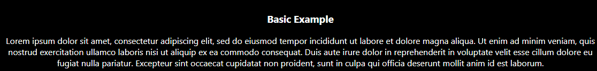
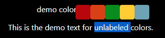
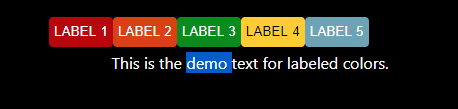

# react-highlight-colors



React component that allows users to select text and highlight it in whichever color they choose. Uses [juliankrispel's](https://github.com/juliankrispel)  [__Selection Popover__](https://github.com/juliankrispel/react-text-selection-popover).
# Installation
```bash
npm install react-highlight-colors
```

# Usage
## Importing Component
```jsx
import Highlighter from 'react-hightlight-colors'
```

# Simplest Usage
The simplest way of getting started is by just including the component with text you want to make highlightable.
```jsx
<Highlighter text={yourText} />
```


## Exporting Highlighted Text
If you wanna store the highlighted data you must pass in a callback function to the `export` prop.

Here is one way of using the export prop:
```jsx
<Highlighter text={yourText} export={(highlightedText) => {
  this.setState({
    exportedText: highlightedText
  })
}} />
```

## Importing Highlighted Text
Once you have exported your text and want to import it back to your Highlighter component, just set the `import` prop to `True`.

## Colors
### Format
In order to choose colors for the highlighter component you must pass in a list of color strings in one of the following formats:
```
'#FFF'
'#FFFFFF'
'rgb(255,255,255)'
```

### Color List
Here is an example of how you can pass in a list of colors.
```jsx
const chosenColors = [
 '#B80000', 
 '#DB3E00', 
 '#008B02', 
 '#FC0',
 'rgb(109,163,182)'
]
```

```jsx
<Highlighter text={yourText} colors={chosenColors} />
```

This is the result of the code above.



### Labeled Colors
You can add labels to your colors, by modifying the list of colors and adding the label after each color in its own list.

Here is an example of a color list with labels:
```jsx
const labeledColors = [
  ['#B80000', 'Label 1'], 
  ['#DB3E00',  'Label 2'],
  ['#008B02'  'Label 3'],
  ['#FC0', 'Label 4'],
  ['rgb(109,163,182)', 'Label 5'],
]
```

```jsx
<Highlighter text={yourText} colors={labeledColors} />
```

Result:




# Props
| Property | Type | Is Required | Default Value | Description |
| - | - | - | - | - |
| `text` | `PropTypes.string` | `required` | n/a | The text that will be highlightable. |
| `style` | `PropTypes.object` | optional | `null` | CSS style applied to text. |
| `colors` | `PropTypes.array` | optional | `['#B80000', '#DB3E00', '#FCCB00', '#008B02', '#006B76', '#1273DE', '#004DCF', '#5300EB', '#EB9694', '#FAD0C3', '#FEF3BD', '#C1E1C5', '#BEDADC', '#C4DEF6', '#BED3F3', '#D4C4FB']` | Color options for the highlighter. |
| `export` | `PropTypes.func` | optional | `null` | Callback function that passes the exported format of the text. Callback is called each time text is highlighted. |
| `import` | `PropTypes.bool` | optional | `false` | Boolean variable which determines if the text being passed in is imported. Text must be exported before being able to import it. |
| `cols` | `PropTypes.number` | optional | `8` | Number of columns of colors per row in color popover. |

# License
MIT © [aqualad11](https://github.com/aqualad11)